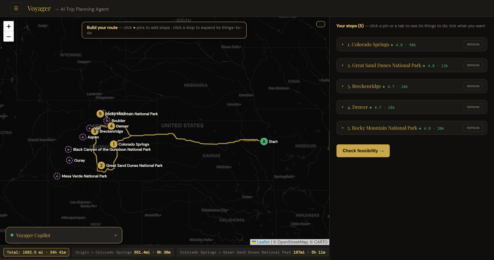
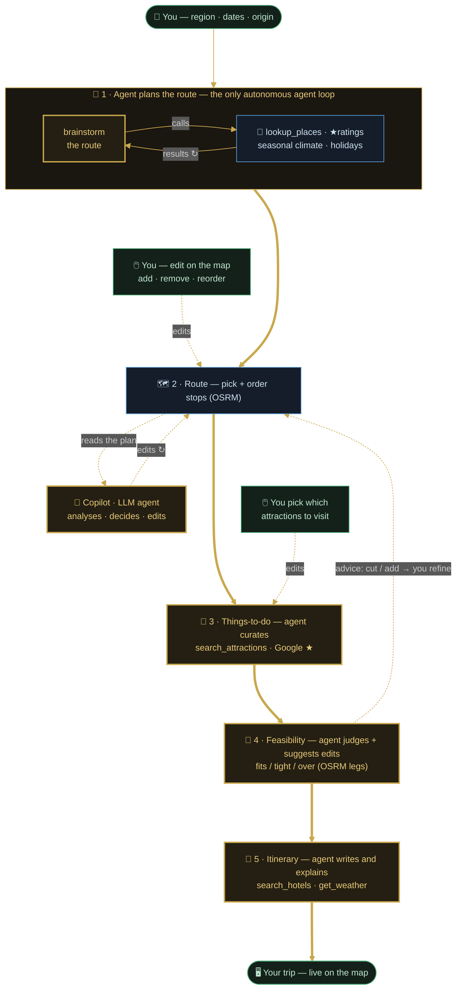
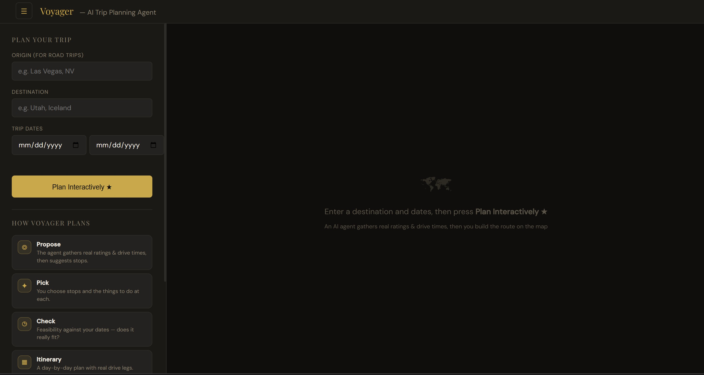
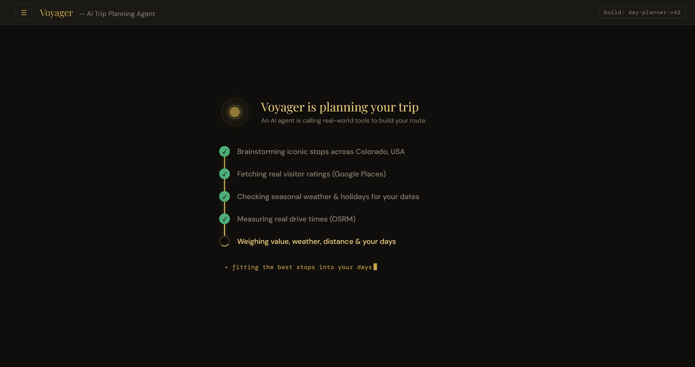
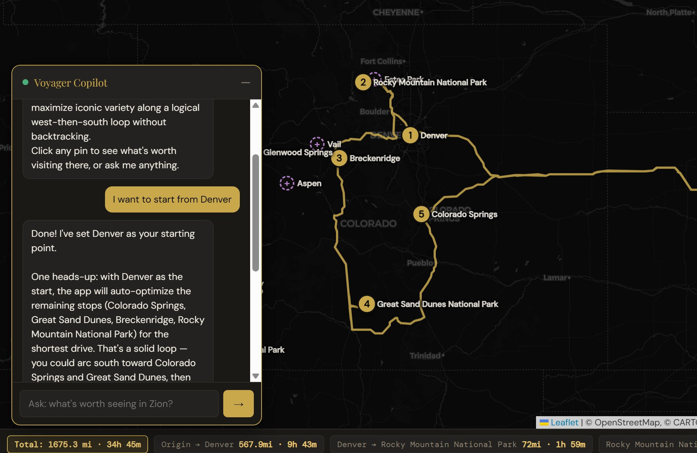
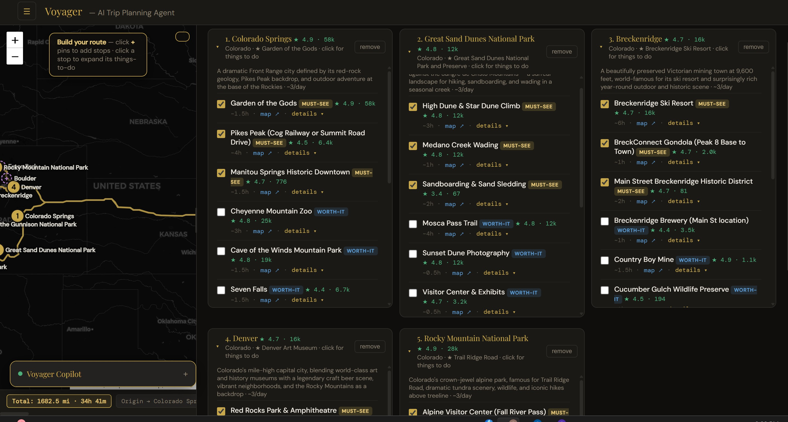
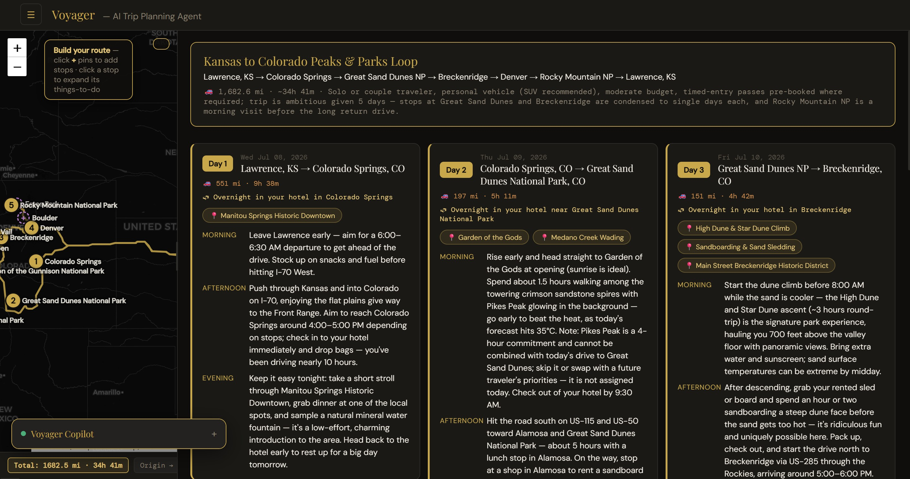
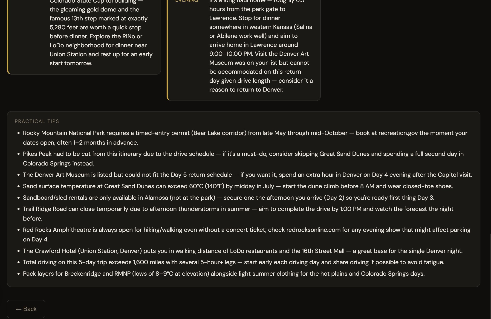

# Voyager — Agentic AI Road-Trip Planner

An interactive, map-based road-trip planner driven by **two AI agents** — one gathers real-world data through tools to plan the trip, the other edits your route live from chat. Type a region and dates; the agent proposes a route grounded in real ratings, weather, and drive times; refine it on the map or just tell the copilot *"add Vail, drop Denver."*



> The models are the **brains** (what to gather, what to pick, when to act); free APIs are the **senses** (ratings, distances, weather, holidays); real routing pins the **exact order**. Grounded in data, not vibes.

---

## How it works

The planning agent brainstorms stops and calls tools in a loop — ratings, seasonal weather, holidays, drive times — then picks the set that fits your days. You build the route on the map; the copilot edits it live.



🟡 AI agent · 🔵 real-world tools · 🟢 you & the map

<details><summary>Workflow as Mermaid (editable source — <code>docs/workflow.mmd</code>)</summary>



</details>

---

## Walkthrough

**1 · Enter your trip** — a region (or a whole country), your dates, and where you're driving from.


**2 · The agent plans** — it brainstorms iconic stops and calls tools for real ratings, seasonal weather, holidays, and drive times, then picks the set that fits your days. The live ticker shows it working.


**3 · Edit it with the copilot** — the second agent. Tell it in plain English — *"start from Denver"*, *"add Aspen, drop Denver"* — and it acts on the map: re-ordering the route and re-optimizing the rest, adding or removing stops, and flagging anything unrealistic.


**4 · Pick what to do** — expand any stop for curated, ★-rated things-to-do with realistic visit times; tick what you want and the map updates.


**5 · Day-by-day itinerary** — real drive legs, a real hotel each night, the day's weather, and sensible pacing after long drives.


**6 · Honest practical tips** — permits, timed-entry reservations, seasonal caveats, and blunt feasibility warnings for the real trip.


---

## What makes it *agentic*

"Agentic" here means one testable thing: the model decides on its own **when to reach for a tool and when to act on the map** — not code calling it at fixed points. And it's **human-in-the-loop**: the agents curate and act, you make the final call.

**How the planning agent thinks.** Give it a goal — *"5 days in Colorado, from Lawrence"* — and it runs its own loop. It brainstorms candidate stops from world knowledge, then *decides it needs real numbers* and calls its tool (`lookup_places`), which returns each place's genuine Google rating and its typical weather for your dates. It reads what comes back, judges whether it has enough or should look up more, and only then — weighing those ratings, the holidays that fall during your trip, the real OSRM drive times, and how long each place takes to see — picks the set that actually fits your days. Nothing hardcodes *"call the tool now"* or *"one stop per day"*; those are the model's calls.

**The copilot** reads the live plan each turn and decides whether to *act* (`"add Vail"` → a hidden directive edits the map) or just *advise*. Every rating, distance, and route is real — Google Places, OSRM, OpenStreetMap, Open-Meteo, Nager.Date — and the exact drivable order is pinned by OSRM.

---

## Run it

```bash
pip install -r requirements.txt
cp .env.example .env          # then add your keys
#   ANTHROPIC_API_KEY=...     (required — the agent + LLM steps)
#   GOOGLE_API_KEY=...        (optional — Google Places ratings; degrades gracefully)
python app.py                 # → http://localhost:5000  → "Plan Interactively"
```

**Stack:** Python · Flask · Anthropic Claude · Leaflet · OSRM · OpenStreetMap/Overpass · Open-Meteo · Google Places · Nager.Date · vanilla JS/CSS
